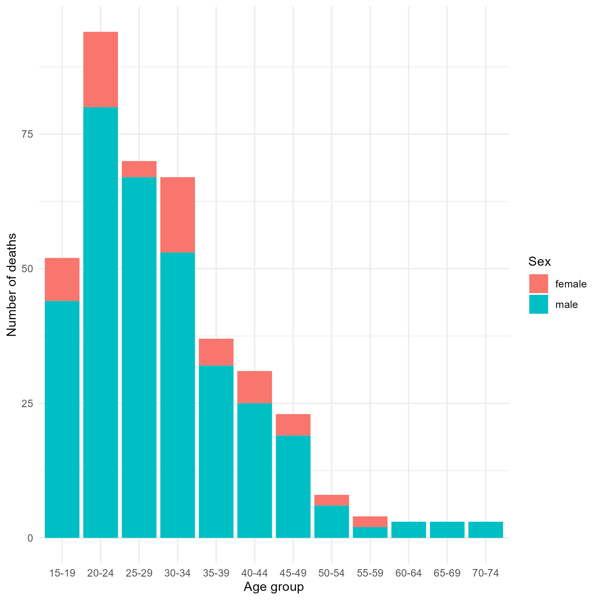

# Intro

In this assignment, you will use your understanding of the tidyverse and RMarkdown to create a short report. The goal is to reinforce your skills in data wrangling, visualization, and reporting using R. Although you're encouraged to work in groups, the final submission should be your individual effort.

Below you'll find a series of tasks that guide you through importing, cleaning, and analyzing a dataset. 

These tasks should be completed in the `week_01_assignment.Rmd` file. So you need to have both this instructions document and the assignment document open.

# TASK 1: LOAD THE REQUIRED PACKAGES

Use `pacman::p_load()` to load the following packages: `{tidyverse}`, `{here}`, `{janitor}` and `{reactable}`.

# TASK 2: IMPORT THE DATA

Use `read_csv()` and `here()` to import the "motorcycle_accidents_colombia.csv" dataset from your data folder.

# TASK 3: CLEAN THE COLUMN NAMES 

Some columns, including the age group column, contain spaces that make them challenging to work with in R. Use `clean_names()` from the `{janitor}` package to address this issue. Store the output as a data frame called `col_accidents_clean`.

# TASK 4: RENAME AND TRANSFORM VARIABLES

Transform the data by doing the following, and store the results as `col_accidents_clean2`:

-   Rename the `condition` to `position`. Use the `rename()` function to perform this change.
-   Change the capitalization of the gender values ("male" and "female") to title case using `mutate()` and `str_to_title()`.

# TASK 5: CREATE A SUBSET

Create a subset of your data by doing the following, and store it as `col_accidents_subset`:

-   Keep only the following columns using the `select()` function: `id`, `gender`, and `age`, `age_group`, and `position`.
-   Use the `filter()` function to exclude any rows where the `position` is listed as "unknown".

**Checkpoint** After this step, verify that your dataset has 395 rows and 5 columns. 

# TASK 6: SUMMARIZE DATA

Using the subset created above, construct a summary table that displays the number of deaths per age group and gender. Use either the `count()` function from `{dplyr}` or a combination of `group_by()` and `summarize()`.

**Checkpoint**: After this step, verify that your summary table has 21 rows and 3 columns. The first few rows of your summary table should look like this:

+-----------+----------+---------+
| age_group | gender   | n       |
|           |          |         |
| \<fctr\>  | \<fctr\> | \<int\> |
+:==========+:=========+========:+
| 15-19     | Female   | 8       |
+-----------+----------+---------+
| 15-19     | Male     | 44      |
+-----------+----------+---------+
| 20-24     | Female   | 14      |
+-----------+----------+---------+
| 20-24     | Male     | 80      |
+-----------+----------+---------+

Render this table using reactable in your RMarkdown document.

# TASK 7: VISUALIZE SUMMARY DATA

Using the summary table you created in the previous step, create a stacked bar plot using `{ggplot2}` to illustrate the number of deaths per age group, segmented

You will need to use the `ggplot()` and `geom_col()` functions to create this plot.

# TASK 8: EXPORT YOUR OUTPUTS

Organize your outputs by creating an "outputs" folder within your project directory.

1.  Export your summary table as a CSV file.

2.  Use `ggsave()` to save your plot.

Save both these files to your "outputs" folder. Make sure to use the `here()` function to specify your file paths.

# TASK 9: KNIT YOUR RMARKDOWN DOCUMENT

Finally, knit your RMarkdown document to an HTML file. You can leave code echo on for this assignment, so that your code chunks are displayed in the final document.

# Challenge Questions (optional)

1. Add text labels to the bars in your plot, to indicate the exact number of deaths for each segment. You can use the `geom_text()` function to achieve this.

2. Add a title, subtitle, and caption to your plot that provide context and explain the data being visualized.