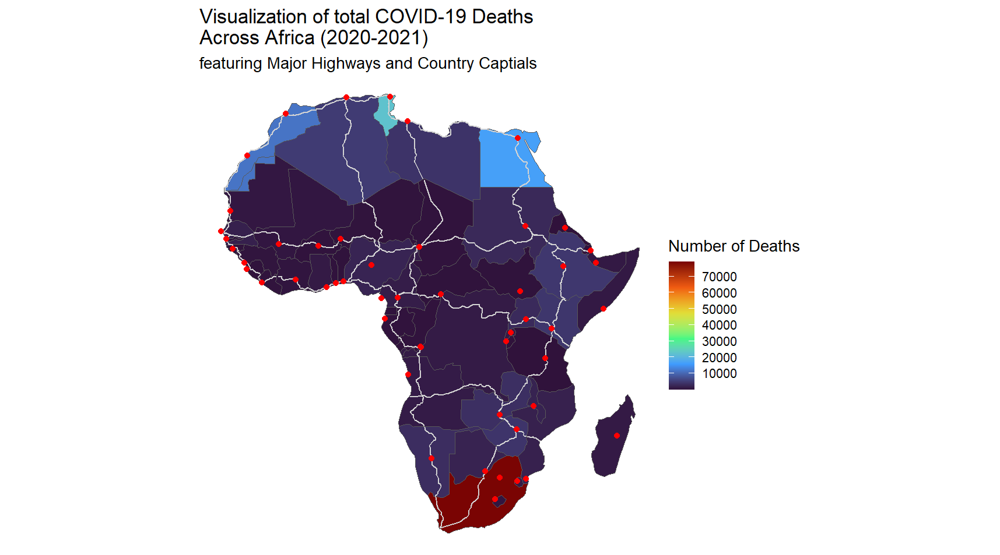

# Introduction

Welcome to the Week 7 workshop! This is the first week of our Geospatial Visualization module. We hope you have fun making maps today!

Please refer to the lesson notes to aid you in the workshop exercise:

-   [Thematic Maps](https://the-graph-courses.github.io/geospatial_viz/ls02_thematic_maps.html)
-   [Physical features](https://the-graph-courses.github.io/geospatial_viz/ls03_physical_features.html)
-   [Density Maps](https://the-graph-courses.github.io/geospatial_viz/ls04_density_map.html)

## Objective

Our goal is to create a multi-layered map of COVID-19 cases and deaths per country in Africa.

Here is an example of what your final plot could look like:



Our COVID data comes from the [COVID-19 Data Hub](https://covid19datahub.io/), which provides a daily summary of COVID-19 cases, deaths, recovered, tests, vaccinations, and hospitalizations for 230+ countries, 760+ regions, and 12000+ administrative divisions of lower level. 

We will combine these case counts with spatial data from the `{afrilearndata}` package including `africountries`, `africapitals` and `afrihighway`.

## Loading Packages

Run this code chunk to load the necessary packages for this workshop.

```{r setup-packages}
# Loading required packages using pacman for package management
if(!require('pacman')) install.packages('pacman')
pacman::p_load_gh("afrimapr/afrilearndata")
pacman::p_load(tidyverse, here, janitor)
```

# Data Exploration and Preparation

## Linelist data: Importing Daily COVID cases and deaths by country

This dataset contains daily reported infections, deaths, and recoveries from COVID-19 for each country in Africa.

```{r import-data}
# Importing and cleaning COVID-19 data for Africa
covid19_africa <-
  read_csv(here("data/covid19_africa.csv")) %>% 
  janitor::clean_names() %>%
  mutate_if(is.character, as.factor)
```

### Exploring Data Variables

```{r explore-data}
# Displaying the first few rows of the dataset to understand its structure
covid19_africa
```

### Understanding Data Structure

```{r data-structure}
# Examining the structure of the dataset to understand the types of data it contains
str(covid19_africa)
```

Important variables to note:

-   There are 54 countries are represented by `iso` and `country` codes.

-   The dataset includes key COVID-19 measures such as reported cases (`infected`), recoveries (`recovered`), and deaths (`death`).

### Summary statistics for each variable

```{r}
# Observe the range of dates covered by the data
summary(covid19_africa)
```

The linelist dates go from Jan 2020 to Aug 2021.

## Loading Spatial Data

### Importing African Country Boundaries

We need spatial data to construct the map. We'll load the country polygons from the `africountries` dataset.

```{r load-spatial}
# Loading spatial data for African countries
data(africountries)
```

### Visualizing Boundaries

This is our boundary map which we will fill later:

```{r view-boundaries}
# Plotting the boundaries to visualize the spatial data
ggplot(data = africountries) +
  geom_sf()
```

# Data Manipulation

## Cleaning and Matching Data

Before we can integrate the spatial and linelist data, we need to ensure the country codes match.

We have boundaries for 54 countries. For each country in `africountries`, we a matching country in `covid19_africa`.

```{r match-codes}
# Identifying country codes in the spatial data that do not match the COVID data
setdiff(africountries$iso_a3,
        covid19_africa$iso)
```

Two countries don't have matching ISO codes. We need to address these mismatches to ensure accurate mapping.

### Resolving Mismatched ISO Codes

We can Identify the countries with mismatched ISO codes.

```{r resolve-mismatch}
# Filter the data
africountries %>%
  dplyr::select(iso_a3, name, name_long) %>%
  filter(iso_a3 %in% c("ESH") |
         is.na(iso_a3))
```

The two countries are:

1)  **Western Sahara**, which is often considered part of Morocco (ISO code "MAR").
2)  **Somaliland**, which is formally recognised as part of Somalia (ISO code "SOM").

### Updating ISO Codes

Run the code below to update ISO codes to ensure consistency across datasets.

```{r update-iso}
# Conditional mutate
africountries_renamed <- africountries %>% 
  mutate(
    iso_a3 = case_when(
      iso_a3 == "ESH" ~ "MAR",
      is.na(iso_a3) ~ "SOM",
      TRUE ~ iso_a3)
  )
```

Check that the country codes now match:

```{r}
# Verifying that all codes now match
setdiff(africountries_renamed$iso_a3,
        covid19_africa$iso)
```

There are some countries in the COVID dataset with no corresponding polygon in the spatial dataset:

```{r}
setdiff(covid19_africa$iso,
        africountries_renamed$iso_a3)
```

These are five small island countries off the coast of the mainland map. Therefore, they are excluded from our geospatial visualizations.

## Aggregating Case Data

### Summarizing COVID-19 Cases

To simplify our map, we'll aggregate the daily COVID-19 case data by country.

```{r summarize-cases}
# Summarizing total cases by country
covid19_afr_inf <- 
  _____________ %>% 
  ________(iso, country) %>% 
  summarise(total_cases = sum(________,
                              ________))
```

Now we have the number of infected cases for each country:

```{r}
covid19_afr_inf
```

Next, we need to match the case counts with to each country's polygon.

### Integrating Spatial and Case Data

We now combine the spatial and case data to prepare for mapping.

```{r integrate-data}
# Joining spatial data with summarized case data
covid19_africa_spatial <- 
  left_join(___________________, 
            _______________,
            by = __________)
```

# Visualization

## Mapping Total COVID-19 Cases

Create a choropleth map to visualize the total number of COVID-19 cases by country.

```{r map-cases}
# Creating a choropleth map using ggplot2

"WRITE_YOUR_CODE_HERE"
```

## Mapping Physical Features and Population Data

### Preparing Death Data

Similar to the total cases, summarize the total deaths per country.

```{r summarize-deaths}
# Summarizing total deaths by country for mapping
covid19_afr_dth <- 
"WRITE_YOUR_CODE_HERE"
```

### Integrating Death Data with Spatial Data

Join the death counts with the spatial data, as we did before.

```{r integrate-death-data}
# Combining spatial data with summarized death data
covid19_afr_dths_spatial <- 
  "WRITE_YOUR_CODE_HERE"
```

### Plot choropleth map

Create a choropleth map showing total cases using {ggplot2}. Fill each country polygon by the number of total cases.

```{r}

"WRITE_YOUR_CODE_HERE"
```

### Visualizing Advanced Geospatial Features

Now, we'll enhance our map by adding layers for highways and capital city populations.

Let's add two layers:

1.  the African trans-continental highway network lines, available in the `afrihighway` dataset.

2.  a Dot map with the population in the capital cities of Africa, from the `africapitals` dataset.

Write ggplot code to do the following: -

-   Plot the two layers, and make sure point data for the capitals are plotting on top of the highways.

-   Color the captial dots red.

-   Edit the color palette of the fill color. (HINT: use functions like `scale_fill_viridis_c()`).

-   Change color the highways to white.

-   Add a descriptive title. If the title is long, wrap the text using a string function.

-   Simplify the theme with `theme_void()`

```{r advanced-visualization}
# Advanced geospatial visualization: Adding highway and capital city layers to the map

"WRITE_YOUR_CODE_HERE"
```

## Challenge Question 1: Joining & Filtering

Create a choropleth map showing total COVID-19 cases for only the countries in **Western Africa.**

Hints:
- You can use the `countrycode` package to identify which countries are in the Western Africa region. 
- You should join the `countrycode::codelist` dataset to your spatial data frame by the ISO 3 letter country code.
- Then filter for only countries where the `region23` variable equals "Western Africa".
- Finally, plot using `ggplot()` and `geom_sf()`.

## Challenge Question 2: Per Capita Cases

Create a choropleth map showing COVID-19 cases per capita for each African country.

Steps:
- Download a dataset with population estimates for each African country in 2020. One good source is the World Bank Data indicators: https://data.worldbank.org/indicator/SP.POP.TOTL

- Import the population data and join it to the `covid19_africa_spatial` data by the ISO 3 letter country code.

- Calculate cases per capita by dividing `total_cases` by the population size.

- Plot the cases per capita for each country using `ggplot()` and `geom_sf()`.